The crits_services/taxii_service allows CRITs instances to send and receive Cyber Threat Intelligence (CTI) using OASIS CTI Technical Committee STIX, CybOX and TAXII Standards.

This document shows how to configure CRITS for communication with various TAXII Services (EclecticIQ test.taxiistand.com, Soltra hailataxii.com,

# EclecticIQ test.taxiistand.com

## Requirements

  CRITS Master Branch [5d182ae99a2912fdf1a86544e64e7b2ef066c994] (or later)
  
  CRITS_SERVICES Master Branch [86b56fc40ff2b9994c3cf42bd4f15b9cbf6516b5] (or later)

## Configuring the TAXII Service for EcelcticIQ TAXIIStand

### Initial Setup (if required)

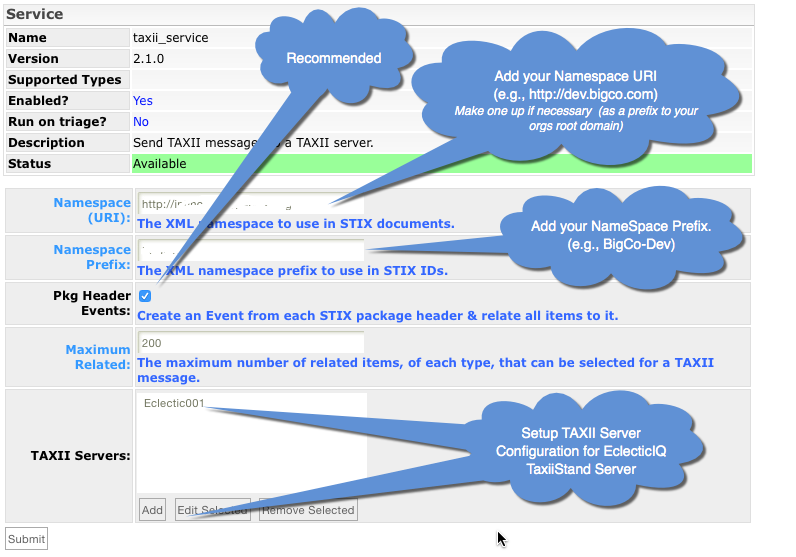

### Configure the EcelcticIQ TAXIIStand TAXII Server in your CRITs

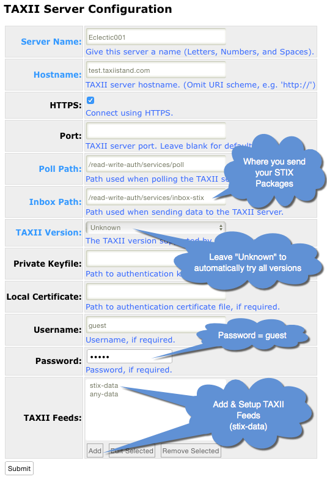

### Configure the EcelcticIQ TAXIIStand TAXII Feed you will pull Packages from

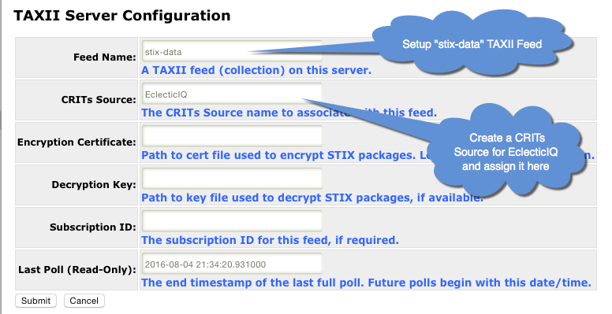

## Sending a Package to EcelcticIQ TAXIIStand

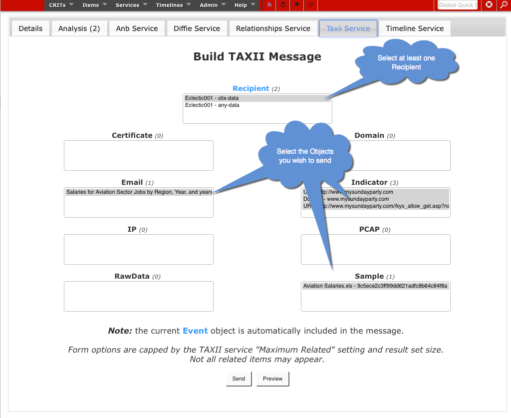
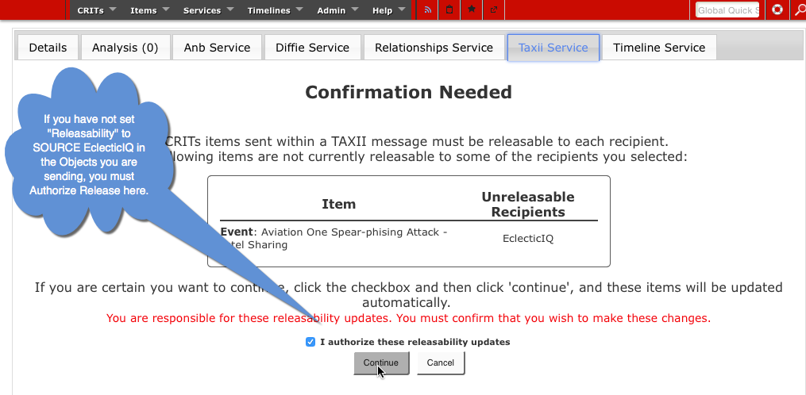
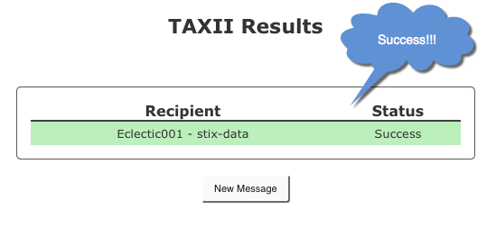

## Receiving Packages from EcelcticIQ TAXIIStand
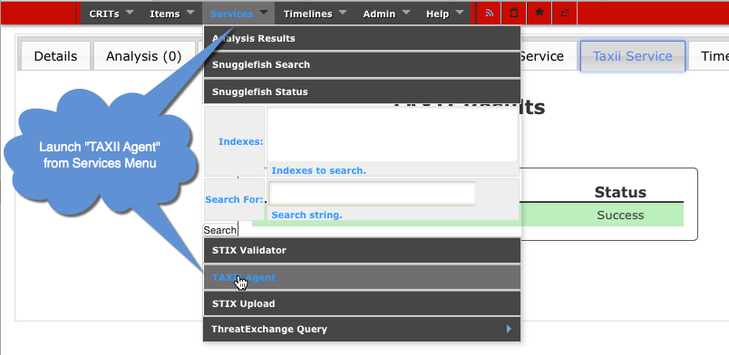
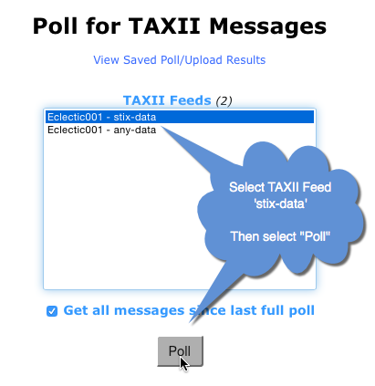
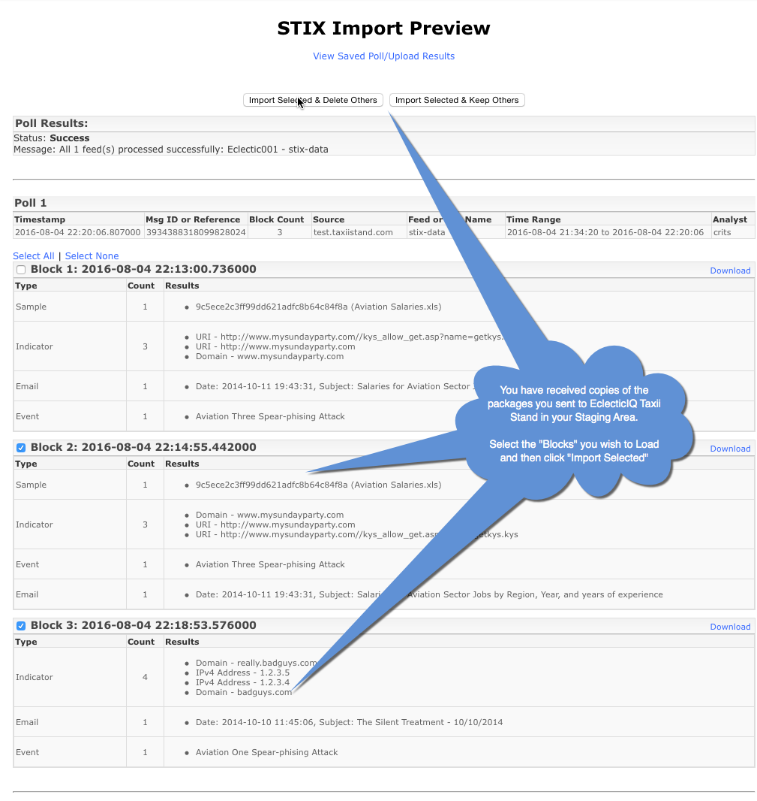
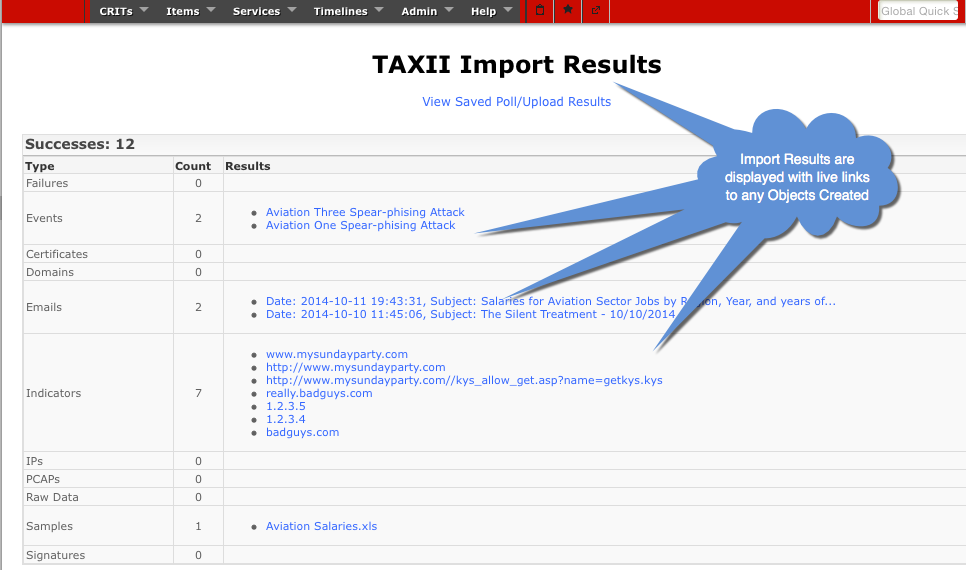
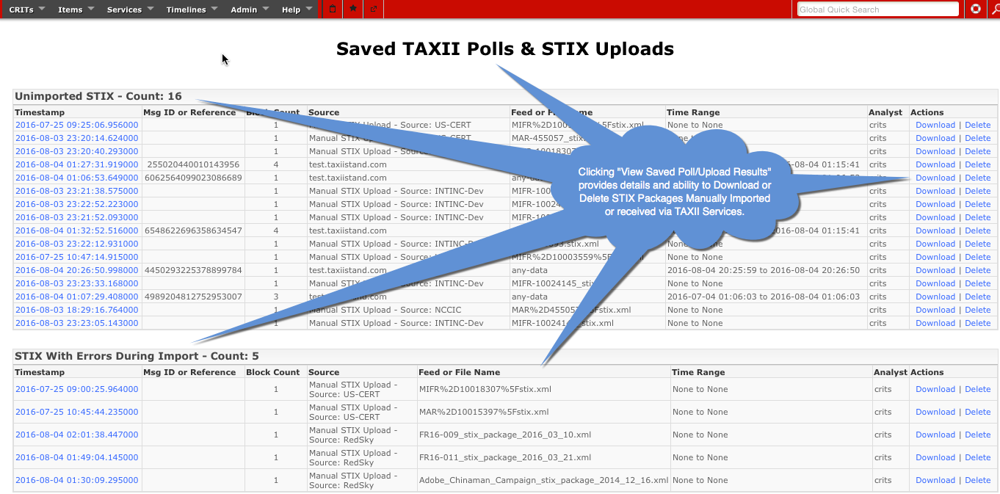

