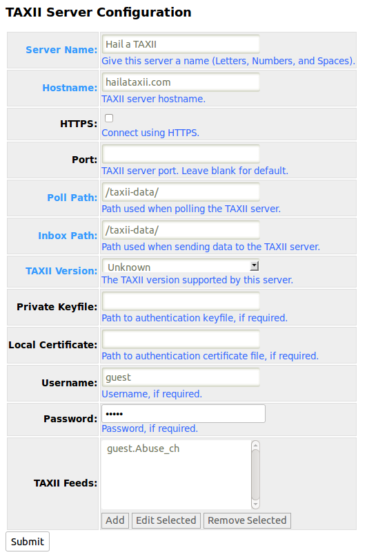

The TAXII service allows you to send and receive content between a CRITs
instance and a TAXII server.

For an example of how to configure for communication with the following publicly available TAXII Test Services:

### hailataxii.com
please see image "HailaTAXII Example Config.png" in the repository or below.

### EclecticIQ TAXII stand  https://test.taxiistand.com
please see image "TAXIIstand Example Config.png" in the repository or below.

